# Tecnologías implementadas

## RabbitMQ
RabbitMQ es un broker de mensajería de código abierto que se utiliza para enviar y recibir mensajes entre diferentes partes de una aplicación. Funciona como un intermediario entre productores de mensajes (que envían mensajes) y consumidores de mensajes (que reciben mensajes).

RabbitMQ permite que las diferentes partes de una aplicación se comuniquen de manera asíncrona y distribuida, lo que es útil para sistemas que necesitan manejar grandes volúmenes de mensajes, como aplicaciones web, sistemas distribuidos, o microservicios. Utiliza un protocolo de mensajería estándar llamado Advanced Message Queuing Protocol (AMQP) que garantiza la fiabilidad y la interoperabilidad entre diferentes componentes de software.

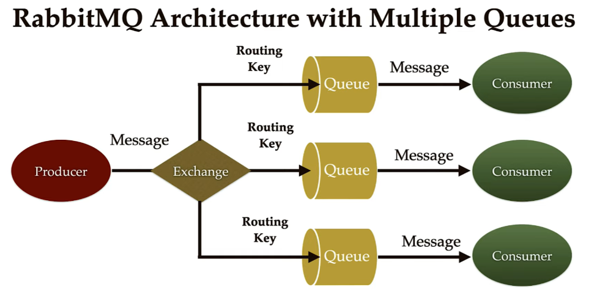

### Características principales 
- Interoperable: RabbitMQ admite varios protocolos estándar abiertos, incluidos AMQP 1.0 y MQTT 5. Además, cuenta con diversas bibliotecas de cliente que se pueden usar con el lenguaje de programación de su elección, eliminando la dependencia del proveedor.
- Flexible: RabbitMQ ofrece múltiples opciones para definir cómo los mensajes se transmiten desde el editor hasta uno o varios consumidores. Esto incluye enrutamiento, filtrado, transmisión en streaming, federación, entre otros.
- Confiable: Con la capacidad de reconocer la entrega de mensajes y replicarlos en un clúster, RabbitMQ asegura que los mensajes estén seguros y sean entregados de manera confiable.

### Aplicaciones
Desacoplamiento de servicios interconectados:
Tiene un servicio de back-end que necesita enviar notificaciones a los usuarios finales. Hay dos canales de notificación: correos electrónicos y notificaciones push para la aplicación móvil.
El back-end publica la notificación en dos colas, una para cada canal. Los programas que gestionan los correos electrónicos y las notificaciones push se suscriben a la cola que les interesa y gestionan las notificaciones en cuanto llegan.

### ➡ Beneficios
RabbitMQ absorbe el pico de carga.
Puede realizar algún mantenimiento en los administradores de notificaciones sin interrumpir todo el servicio.

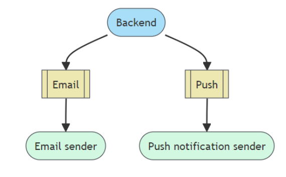

## Kotlin
Kotlin es un lenguaje de programación moderno, conciso y seguro que se ejecuta en la Máquina Virtual de Java (JVM) y también puede compilar a código fuente de JavaScript o código nativo a través de LLVM(Low Level Virtual Machine). Fue desarrollado por JetBrains y es completamente interoperable con Java, lo que significa que se pueden utilizar librerías de Java en proyectos Kotlin y viceversa.


### Características principales 

- Conciso: Kotlin reduce mucho el código boilerplate (repetitivo) típico de Java, lo que hace que sea más conciso y fácil de leer y mantener.

- Interoperabilidad: Kotlin es 100% interoperable con Java, lo que significa que puedes usar bibliotecas de Java en proyectos Kotlin y viceversa sin ningún problema.

- Extensibilidad: Kotlin permite agregar nuevas funcionalidades a las clases existentes sin tener que heredar de ellas, gracias a sus extensiones de funciones.

- Inmutable por defecto: Kotlin fomenta la programación inmutable mediante la declaración de variables como val (valores inmutables) por defecto, lo que ayuda a prevenir errores y a escribir código más seguro.

- Comprobaciones de rango: Kotlin incluye comprobaciones de rango en tiempo de compilación para asegurar que los índices de matrices, listas y otros elementos estén dentro de los límites válidos, evitando así errores comunes.

### Aplicaciones 

- Pruebas unitarias y de integración: La kotlin.test biblioteca proporciona anotaciones
para marcar funciones de prueba y un conjunto de funciones de utilidad para realizar afirmaciones en las pruebas, independientemente del marco de prueba que se utilice.El marco de prueba se abstrae a través de la clase Asserter . Se proporciona una implementación básica Asserterlista para usar. Tenga en cuenta que la clase no está diseñada para usarse directamente desde las pruebas; en su lugar, use las funciones de aserción de nivel superior que delegan en Asserter.


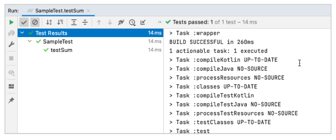

- Análisis de datos: Con las herramientas de análisis de datos exploratorios (EDA) de Kotlin, como los cuadernos de Kotlin , Kotlin DataFrame y Kandy , tiene a disposición un amplio conjunto de capacidades para mejorar las habilidades analíticas y brindar soporte en diferentes escenarios:

    - Cargue, transforme y visualice datos en varios formatos.
    - Analice de manera eficiente los datos almacenados en bases de datos relacionales.
    - Obtenga y analice conjuntos de datos dinámicos y en tiempo real desde API web.

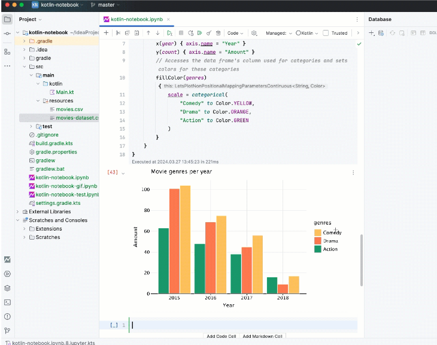

# Problema propuesto
Ante la necesidad de gestionar el envío asíncrono de información de tarjetas NFC en un entorno de transporte público, se busca una solución robusta que permita registrar las transacciones y eventualmente sincronizarlas con el sistema central. Esta solución debe considerar posibles errores de comunicación debido a la ubicación de los autobuses y la demanda variable del sistema central en momentos específicos. Por lo tanto, se recomienda la comunicación asíncrona para evitar la saturación del sistema centralizado.


## Requerimientos del Sistema
El sistema debe ser capaz de:
- Registrar Transacciones

    Capturar y almacenar transacciones de tarifas en tiempo real en cada POS.
    Validar todas las transacciones antes de almacenarlas para asegurar la integridad y autenticidad de los datos.
- Almacenamiento Local y Sincronización:

    Almacenar de manera segura las transacciones en el dispositivo local del POS cuando no haya conexión a internet.
    Sincronizar automáticamente las transacciones almacenadas localmente con el sistema central una vez que la conexión a internet esté disponible.
    Proveer mecanismos de reintento para la sincronización en caso de fallos temporales de comunicación.
- Manejo de Errores:

    Detectar y manejar errores de comunicación durante la sincronización de datos.
    Proveer mensajes claros y detallados sobre el estado de la transacción (éxito, error, sin conexión) al conductor del autobús.
    Implementar un sistema de logs para registrar transacciones y eventos importantes para futuras auditorías y análisis.

- Monitorización y Registro:

    Registrar todas las transacciones y eventos importantes en un log para auditorías y análisis posteriores.
    Monitorear el estado del sistema y reportar cualquier problema o anomalía de manera proactiva.
- Escalabilidad:

    Diseñar el sistema para manejar un número creciente de transacciones y usuarios sin pérdida de rendimiento.
    Utilizar técnicas de optimización de recursos para asegurar un rendimiento eficiente incluso con una alta carga de transacciones.
- Alta Disponibilidad:

    Asegurar que el sistema esté disponible la mayor parte del tiempo, minimizando el tiempo de inactividad.
    Implementar redundancia y estrategias de recuperación para asegurar la disponibilidad continua del sistema.


## Características Prioritarias

El sistema debe priorizar las siguientes características:
- Mantenibilidad
- Capacidad de prueba
- Escalabilidad
- Fiabilidad

# Solución propuesta
## Arquitectura de Mensajería Asíncrona:
Utilizamos RabbitMQ como servidor de mensajería para la comunicación asíncrona entre el POS y el sistema central.
Los mensajes que contienen la información de las transacciones de las tarjetas NFC son enviados desde el POS al servidor RabbitMQ.
El sistema central está a la espera de estos mensajes para procesarlos cuando esté disponible.
## Almacenamiento Local en el POS:
Implementamos una base de datos local en el POS para almacenar temporalmente la información de las transacciones de las tarjetas NFC.
Esta base de datos actuará como un búfer que almacenará las transacciones cuando no haya conexión a Internet para enviar los mensajes al servidor RabbitMQ.
Una vez que la conexión a Internet esté disponible, el POS enviará las transacciones almacenadas en la base de datos local al servidor RabbitMQ para su procesamiento por el sistema central.
## Mecanismo de Sincronización:
Se implementó un mecanismo de sincronización en el POS que verifica periódicamente la disponibilidad de conexión a Internet.
Cuando haya conexión a Internet, el POS intentará enviar las transacciones almacenadas en la base de datos local al servidor RabbitMQ.
Se realizan reintentos de envío en caso de que ocurran errores de conexión.
## Manejo de Errores y Tolerancia a Fallos:
El sistema está diseñado para manejar errores de conexión y otros errores de manera adecuada.
Se implementaron mecanismos de reintentos y de manejo de excepciones para garantizar que las transacciones se procesen correctamente, incluso en condiciones de conectividad intermitente.
# Diagrama UML de la Solución Propuesta:

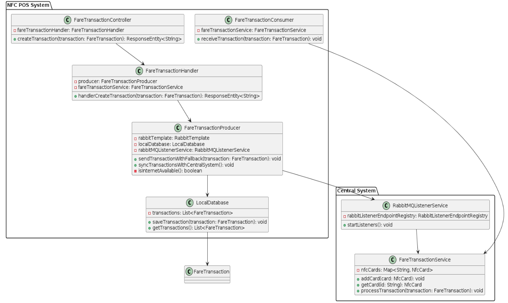
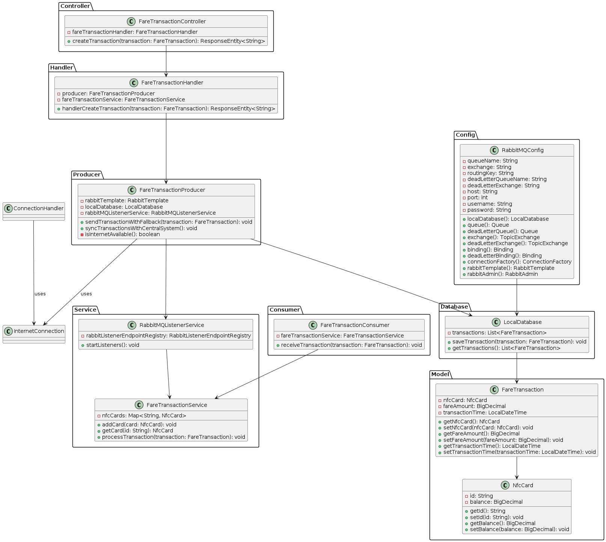

# Plan de pruebas
## 1. Introducción
Este documento presenta un plan de pruebas para el sistema de recolección de tarifas de Capsule Corporation.
El objetivo de este plan es asegurar que el sistema funcione correctamente y cumpla con los requisitos establecidos.
## 2. Objetivos de las Pruebas
Los objetivos de las pruebas son:
- Verificar que todas las funcionalidades del sistema funcionen como se espera.
- Identificar y corregir cualquier defecto antes de que el sistema se ponga en producción.
- Asegurar que el sistema pueda manejar la carga esperada de transacciones.
- Verificar que el sistema pueda recuperarse de fallos y continuar operando.
## 3. Estrategia de Pruebas
La estrategia de pruebas se centrará en pruebas de integración y pruebas manuales para medir la fiabilidad de la aplicación.
### 3.1 Pruebas de Integración
Las pruebas de integración se realizan para verificar cómo los componentes del sistema interactúan entre sí. Estas pruebas incluirán:
- Verificar que una transacción se puede crear y enviar correctamente.
- Verificar que una transacción se puede recibir y procesar correctamente.
### 3.2 Pruebas Manuales
Las pruebas manuales se realizan para verificar la funcionalidad del sistema desde la perspectiva del usuario. Estas pruebas incluirán:
- Verificar que el sistema puede manejar un gran número de transacciones simultáneas.
- Verificar que el sistema puede recuperarse de fallos y continuar operando bajo carga pesada.
- Verificar que una transacción se puede guardar en la base de datos local si la conexión a RabbitMQ falla.
- Verificar que las transacciones guardadas en la base de datos local se puedan sincronizar con el sistema central cuando la conexión a RabbitMQ se restablezca.
```kotlin
private fun sendTransactions() {
    for (i in 0 until 10000) {
        val cardId = UUID.randomUUID().toString()
        val card = NfcCard(cardId, BigDecimal.TEN)
        val transactionTime = LocalDateTime.now().plusSeconds(1)
        val transaction = FareTransaction(card, BigDecimal.ONE, transactionTime)

        try {
            fareTransactionHandler.handlerCreateTransaction(transaction)
        } catch (e: AmqpIOException) {
            localDatabase.saveTransaction(transaction)
        }
    }
}

private fun processTransactions() {
    for (transaction in localDatabase.getTransactions()) {
        fareTransactionConsumer.receiveTransaction(transaction)
        localDatabase.getTransactions().remove(transaction)
    }
}
```
- Se utilizará esta prueba manual para simular la creación y envío de una alta carga de transacciones al sistema central.

# Resultados de ejecución del plan de pruebas:

- Se inicia el servicio de RabbitMQ y se ejecuta la prueba manual para simular la creación, envío, recepción y procesamiento de transacciones al sistema central.

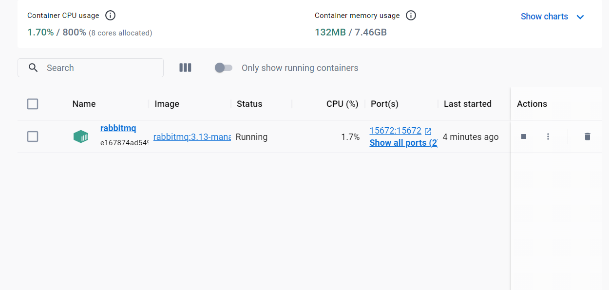

- Se observa que las transacciones se envían correctamente al sistema central y se procesan sin errores.

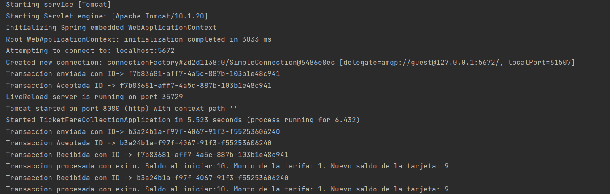

- Ahora se corta la conexion con el sistema, se puede observar que a pesar de los fallos en la conexión, el sistema sigue funcionando y procesando transacciones.

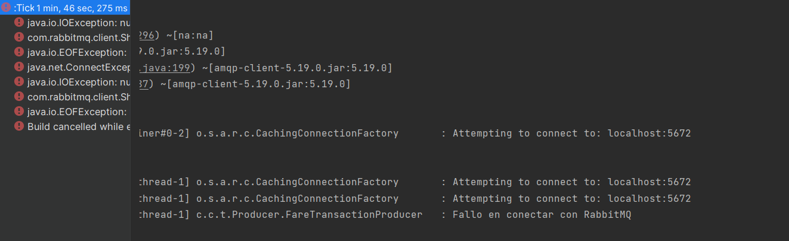

- Se observa que las transacciones se aceptan y se guardan correctamente en la base de datos local cuando la conexión falla.

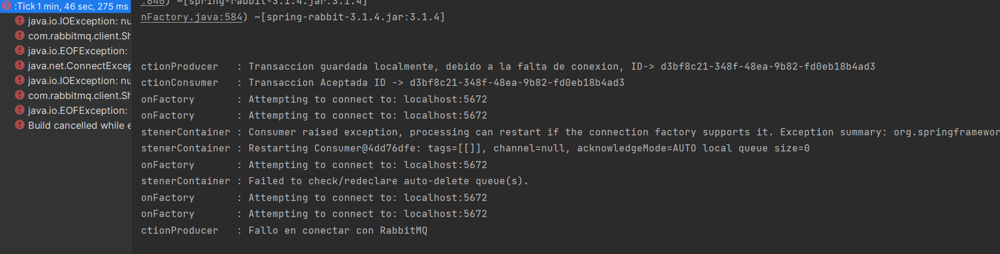

- Después, se restablece la conexión con el sistema central y se empiezan a enviar las transacciones guardadas en la base de datos local.

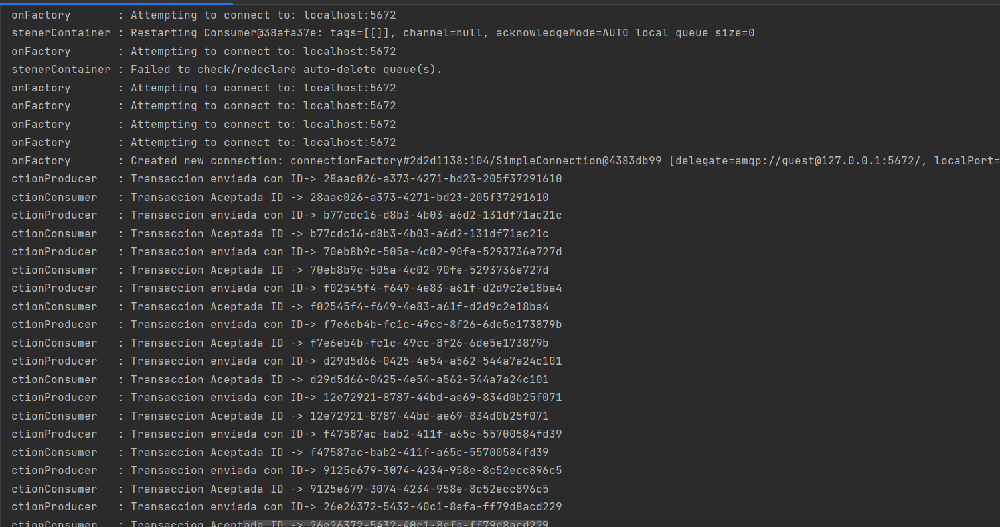

- Finalmente, se sincronizan las transacciones guardadas y se procesan en el sistema central.

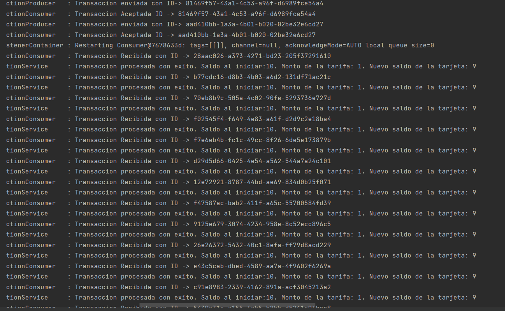
